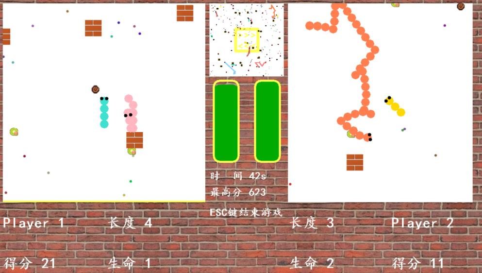

# Greedy-Snake-Game

A Greedy Snake Game with advanced features and multiple game modes, implemented in C++ using graphics.h library.

## Features

### Game Mechanics
- Advanced collision detection system
- Dynamic speed acceleration mechanics
- Multiple fruit types with different effects
- Mini-map for better game overview

### Game Modes
- Single Player Mode
- AI Battle Mode
- Multiplayer Mode

## Requirements
- C++ compiler (g++ recommended)
- graphics.h library
- Windows operating system (for graphics.h compatibility)

